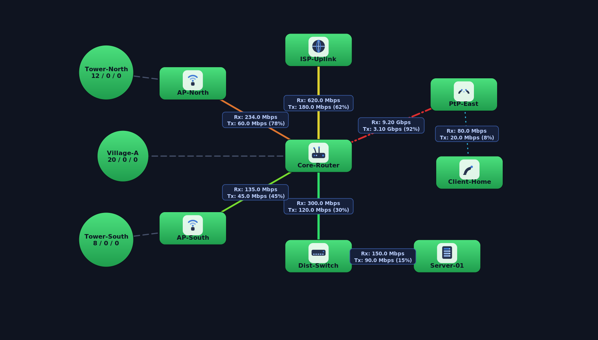
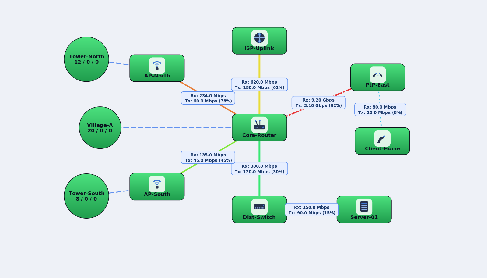
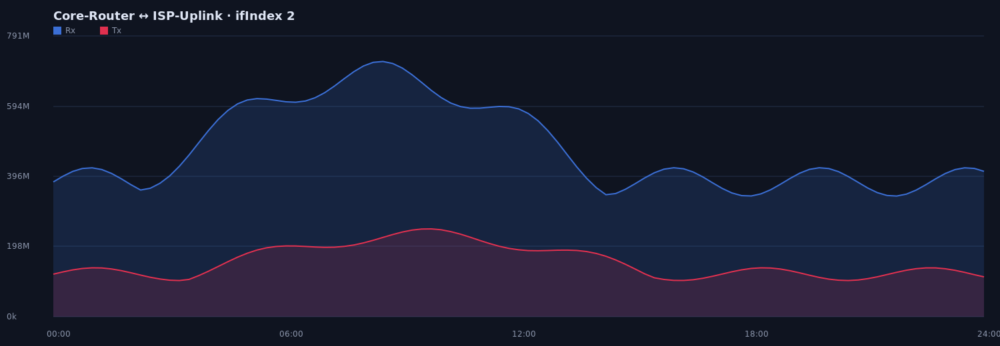
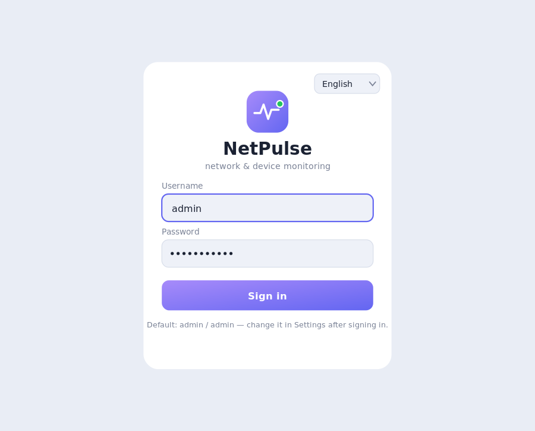

# NetPulse

A modern, self-hosted **network monitoring & mapping** web application — a spiritual successor to MikroTik's *The Dude*, rebuilt in plain PHP with a clean web UI.

NetPulse renders your network as interactive maps (devices, links, sub-maps), monitors availability in real time (ICMP / TCP / SNMP), shows **live Rx/Tx traffic per interface** with utilization-based link colors, records traffic history into graphs, and sends **Telegram** alerts — all from a single PHP app you run on your own server.

It can **import an existing `The Dude` database** (`dude.db`) so you don't have to rebuild your topology from scratch, and you can keep editing maps, devices and links directly from the browser.

> Built by a WISP operator to replace an aging Dude install on a real network. No Java, no Windows agent — just PHP + your browser.

## Screenshots

> The screenshots below use a **fictional example network** — no real device data.



*Interactive map with device icons, sub-maps, three-state status colors, live per-interface Rx/Tx and utilization-based link colors (blue -> green -> yellow -> orange -> red).*



*The same map in light theme.*



*Per-link traffic history recorded from SNMP polling.*



*Sign-in screen with a language picker — pick your language on first launch.*

## Features

- **Interactive maps** — devices, links and sub-maps rendered as SVG, faithfully following the Dude layout (positions, link styles: solid / dotted / dashed, thickness). Auto-sized sub-map circles.
- **Import from The Dude** — one-click import from an existing `dude.db` (maps, devices, device types, icons, probes, services, links, SNMP profiles). Maps keep their original Dude order.
- **Live monitoring** — three-state status (up / pending / down) like Dude. Uses `fping` for fast parallel ICMP plus **parallel TCP checks** (services and fallback ports), so even a large outage with dozens of unreachable devices is checked within a couple of seconds — and it still works on shared hosting where ICMP/`exec` is blocked.
- **Real per-interface traffic** — SNMP polling of `ifHCInOctets`/`ifHCOutOctets` (64-bit, with 32-bit fallback) turned into live Rx/Tx bps on each link.
- **Utilization-based link colors** — link color shifts across a full spectrum based on interface utilization %, visible even at low load.
- **Graphs** — traffic history recorded over time per link, with a dedicated *Graphs* section.
- **Telegram notifications** — native PHP (no `wget`/`curl` shell-out), fully configurable in the UI. Alerts are queued: if Telegram is unreachable they are retried with back-off instead of being lost, and a down/up pair that piles up while Telegram is offline is merged into one *"was down from X to Y"* message.
- **User roles** — `administrator` (full access incl. backup/restore & resetting others' passwords), `admin` (user management), `user` (read-only + change own password).
- **Editing from the web** — add/edit/delete devices, links (line type via dialog) and maps directly in the browser.
- **Backup / restore** and re-import from the Settings screen.
- **Multi-language** — UI available in English, Slovak, Czech, German, Polish and Hungarian; pick your language on the login screen or later in Settings -> Appearance (saved in your browser).
- **Automatic time zone** — detected from the server on first run, overridable in Settings -> Appearance. Event times and Telegram messages always match your local clock.
- **Self-maintaining database** — status and traffic history are sampled and pruned automatically, so the database stays small and fast no matter how long NetPulse runs.
- **Crash-resistant workers** — each monitoring cycle probes the whole network first and then records all results in one short transaction, so a busy database never leaves half-written state, duplicate events or dangling outages.
- **Modern UI** — light / dark / auto themes, responsive layout with touch controls, sortable tables with sticky headers, clean SVG device icons.

## Requirements

- **PHP 8.1+** (CLI + FPM) with **PDO**: `pdo_sqlite` (default) or `pdo_mysql`
- A web server — **nginx + php-fpm** recommended (Apache + mod_php works too)
- For live **ICMP** status: **`fping`** (`apt install fping`) and PHP's `exec()` must be enabled (not listed in `disable_functions`). Without it, NetPulse automatically falls back to TCP-connect checks, so it still works on locked-down/shared hosting.
- For **SNMP traffic**: the **net-snmp** CLI tools **`snmpget` / `snmpwalk`** (`apt install snmp`) *or* the PHP `snmp` extension
- SQLite works out of the box (no DB server); MySQL 8 / MariaDB 10.6+ is optional for larger / multi-user setups. For MySQL create the database with `CHARACTER SET utf8mb4` and set `DB_DRIVER` directly in `config.php` (PHP-FPM clears environment variables by default). Importing from The Dude needs `pdo_sqlite` either way, because `dude.db` itself is SQLite.

On Debian/Ubuntu a typical install:

```bash
sudo apt install php-cli php-fpm php-sqlite3 fping snmp
# optional: php-mysql (for MySQL) ,  php-snmp (instead of the net-snmp CLI tools)
```

## Quick start (SQLite)

```bash
git clone https://github.com/<your-user>/netpulse.git
cd netpulse

# make the data dir writable by the web server
mkdir -p data && chmod 775 data

# serve it (dev only) — or point nginx/apache at this folder
php -S 0.0.0.0:8080
```

Open `http://localhost:8080/`. On first run the schema is created automatically.
Default login is **admin / admin** — **change the password immediately** in Settings.

### Import your existing Dude database

Copy your `dude.db` into `data/` and run:

```bash
php import_dude.php data/dude.db
```

...or use **Settings -> Backup & import -> Import from Dude** in the web UI. Your `dude.db` is private and is **git-ignored** — it never ends up in the repository.

## Production (nginx + php-fpm)

**1. Web app** — point an nginx `server {}` block at the project folder using a PHP-FPM pool:

```nginx
server {
    listen 80;
    server_name netpulse.example.com;
    root /home/youruser/netpulse;
    index index.php;
    client_max_body_size 64m;                 # matches .user.ini (import dude.db / restore backup)

    location / { try_files $uri $uri/ /index.php?$query_string; }
    location ~ \.php$ {
        include snippets/fastcgi-php.conf;
        fastcgi_pass unix:/run/php/php8.2-fpm.sock;   # adjust to your FPM socket
    }
    location ~ ^/(data|\.git) { deny all; }   # never serve the database / sessions / git
    # CLI workers and libraries are not web pages (they also refuse to run outside the CLI)
    location ~ ^/(monitor|snmp_poll|cleanup|diag2?|import_dude|importer|DudeParser|db|config|telegram|snmp_lib|probe_lib|auth|cli_guard)\.php$ { deny all; }
}
```

**2. Permissions** — `data/` must be writable by the FPM pool user (sessions are auto-created in `data/sessions`):

```bash
chmod -R u+rwX data && sudo chown -R www-data:www-data data   # use your FPM user
```

**3. Background workers** — monitoring runs from the CLI, **not** from web requests. There are two:

- **Availability monitor** — `monitor.php` does **one pass per run** (it does *not* loop). Run it on a schedule.

  Cron (60-second granularity):

  ```cron
  * * * * * cd /home/youruser/netpulse && php monitor.php >/dev/null 2>&1
  ```

  …or, for faster (~15 s) down-detection, a systemd service that loops:

  ```ini
  # /etc/systemd/system/netpulse-monitor.service
  [Unit]
  Description=NetPulse availability monitor
  After=network.target
  [Service]
  User=www-data
  WorkingDirectory=/home/youruser/netpulse
  ExecStart=/bin/sh -c 'while true; do php monitor.php; sleep 15; done'
  Restart=always
  [Install]
  WantedBy=multi-user.target
  ```

- **SNMP traffic poller** — `snmp_poll.php` **has a built-in loop**; the interval comes from Settings:

  ```ini
  # /etc/systemd/system/netpulse-snmp.service
  [Unit]
  Description=NetPulse SNMP traffic poller
  After=network.target
  [Service]
  User=www-data
  WorkingDirectory=/home/youruser/netpulse
  ExecStart=/usr/bin/php snmp_poll.php loop
  Restart=always
  [Install]
  WantedBy=multi-user.target
  ```

Enable both:

```bash
sudo systemctl daemon-reload
sudo systemctl enable --now netpulse-monitor netpulse-snmp
```

> Note: `fping` needs raw-socket rights. The Debian `fping` package ships with the needed capability by default; if ICMP still fails, NetPulse falls back to TCP checks automatically.

Configuration lives in `config.php` — DB driver, MySQL credentials (if used), check method (`auto` / `tcp` / `icmp`) and the down-after grace period. Telegram, SNMP profiles and the poll interval are set in the **Settings** screen.

## Configuration highlights (`config.php`)

| Key | Purpose |
|---|---|
| `APP_NAME` | Name shown in header, title and login |
| `DB_DRIVER` | `sqlite` (default) or `mysql` |
| `CHECK_METHOD` | `auto` (ping if possible else TCP), `tcp`, or `icmp` |
| `TCP_FALLBACK_PORTS` | Ports probed for TCP availability (Winbox 8291, 80, 443, 22, ...) |
| `DOWN_AFTER` | Seconds of no response before a device is marked down |
| `USE_FPING` | Use `fping` for fast parallel ICMP |
| `APP_TIMEZONE` | Time zone; empty = detect from the server automatically |
| `HISTORY_DAYS` | How many days of status history to keep (default 14) |
| `HISTORY_EVERY` | Latency sampling interval in seconds (default 60); status changes are always recorded |
| `TRAFFIC_DAYS` | How many days of per-link traffic history to keep (default 90) |

The values in `config.php` are starting defaults. Time zone, history retention, Telegram, SNMP profiles and poll intervals can all be changed at runtime in the **Settings** screen, which stores them in the database and takes precedence over `config.php`.

## Upgrading

Replace the application files (keep `config.php` and `data/`) and restart the workers:

```bash
sudo systemctl restart netpulse-monitor netpulse-snmp
```

Database migrations run automatically on the first request or monitoring cycle — new columns, tables and indexes are added in place, existing data is kept.

## Maintenance

NetPulse prunes its own history every hour, so under normal operation there is nothing to do. Two things are worth knowing.

**Why pruning matters.** Every monitoring cycle writes one row per device. On a 150-device network checked every 25 seconds that is roughly half a million rows a day, so without retention the database grows into gigabytes and queries slow down until writes start timing out. Defaults keep 14 days of status history (sampled once a minute) and 90 days of traffic history; tune them in Settings -> Traffic measurement.

**One-time cleanup.** If you are upgrading from an older version whose database has already grown, run the bundled maintenance script. It deletes expired history, creates any missing indexes, removes stale session files and compacts the file with `VACUUM`:

```bash
# dry run - shows row counts and what would be deleted, changes nothing
php cleanup.php

# for real: keep 14 days of status history and 30 days of traffic history
sudo systemctl stop netpulse-monitor netpulse-snmp
php cleanup.php --run 14 --tok 30
sudo systemctl start netpulse-monitor netpulse-snmp
```

Run it as the same user the web server uses (`sudo -u www-data php cleanup.php …`) — the maintenance scripts refuse to run as root, because root-owned `-wal`/`-shm` files would lock the web app and the monitor out of the database. And **always stop the workers first** — `VACUUM` cannot shrink the file while another process holds the database open, and it will take far longer.

## Troubleshooting

Two diagnostic scripts ship with the project. Neither modifies anything.

```bash
php diag.php                    # environment, fping, device counts, Telegram config, recent events
php diag.php "Device name"      # plus the status history of one device
php diag2.php 2026-09-19        # outage detection lag and gaps in monitoring for a given day
```

**Alerts arrive late, or not at all.** Run `php diag2.php <date>`. The *lag* column is the delay between a device going silent and the outage being declared; roughly `DOWN_AFTER` plus one cycle is normal. Large *gaps* mean the monitor was not running at all — check `journalctl -u netpulse-monitor` for that window.

**A service is red but the device is green.** The device answers ping, but one of its services does not — e.g. an imported *dude* probe that checks TCP port 2210 of a server that no longer runs The Dude. The *Services* list shows what each service checks, and *Tools → Test now* in the device window runs ping and every service check on the spot. Delete services you no longer need.

**No alert for a short outage.** Outages shorter than `DOWN_AFTER` never turn red and never notify, by design. Lower it in `config.php` if you want to catch brief drops, at the cost of more messages from flapping devices.

**Telegram messages stopped arriving.** `php diag.php` shows how many messages are waiting in the queue. While Telegram is unreachable, messages are retried with increasing delay (30 s up to 15 min) and dropped after 24 hours; the log shows *"odoslanie zlyhalo"* with the HTTP code. A wrong bot token or a bot that is not a member of the chat also shows up here.

**`database is locked` in the logs.** Make sure `journal_mode` is `wal` (`php diag.php` prints it) and that the indexes exist — run `php cleanup.php --run`. An occasional *"výsledky NEZAPÍSANÉ (DB zamknutá)"* line is harmless: that cycle's results are discarded as a whole and the next cycle measures again, so nothing is half-written.

**Monitoring cycle is slow.** Time it with `time php monitor.php`. Install `fping` if it is missing — without it devices are pinged one at a time. Each unreachable device also costs one second per port in `TCP_FALLBACK_PORTS`, so trimming that list speeds up large outages.

## Languages

The interface ships in **English, Slovencina, Cestina, Deutsch, Polski and Magyar**. Translations live in `assets/i18n.js` — add a language by copying one of the dictionaries and translating the values. Contributions welcome.

## Project layout

```
index.php          SPA shell + navigation
api.php            JSON API (maps, devices, links, users, settings, graphs...)
assets/app.js      Frontend SPA (map rendering, dialogs, tables)
assets/i18n.js     UI translations + language switcher
assets/style.css   Themes (light/dark/auto), responsive layout
DudeParser.php     Reverse-engineered parser for The Dude's binary object blobs
importer.php       Shared import logic (dude.db -> app schema)
import_dude.php    CLI import entry point
monitor.php        Availability monitoring (one pass per run)
snmp_lib.php       SNMP get/walk helpers (v1/v2c/v3)
snmp_poll.php      SNMP traffic poller (loop worker)
telegram.php       Native Telegram sender
db.php / config.php  PDO layer, retry-on-busy helpers & configuration
probe_lib.php      Availability probes (fping, parallel TCP) shared by the monitor and "Test now"
cli_guard.php      Keeps CLI scripts from running via the web or as root
cleanup.php        Maintenance: prune history, add indexes, VACUUM (--siroty: devices on no map)
diag.php           Diagnostics: environment, monitoring and Telegram health
diag2.php          Diagnostics: detection lag and gaps in monitoring
schema_*.sql       SQLite / MySQL schema
```

## Security notes

- Real network data (`dude.db`, `data/app.db`, sessions) is **git-ignored** — this repo ships clean, with no topology or credentials.
- Change default credentials on first login — the app shows a warning banner until you do. New passwords must be at least 8 characters.
- Sign-in is rate-limited: after 10 failed attempts from one IP address, that address is blocked for 15 minutes. (Behind a reverse proxy such as Cloudflare every visitor shares the proxy's address — configure nginx `real_ip` so PHP sees the real client IP.)
- Database backups (which contain password hashes, device credentials, SNMP secrets and the Telegram token) can only be downloaded by an `administrator`. SNMP communities and v3 passwords are likewise visible to administrators only.
- All state-changing API calls require `POST` with a custom header, so a foreign website cannot trigger them through a logged-in browser (CSRF).
- SNMP community strings / v3 credentials and Telegram tokens are stored in your local database, not in the code.

## Roadmap

- Optional ping/latency graphs and PNG export of graphs.
- More UI languages.

## License

Released under the [MIT License](LICENSE). (c) 2026 Juraj Chudy.
